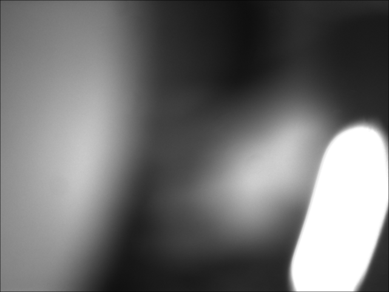

# Example of DC1394.jl

### \# Prepairing DC1394 package


```julia
using DC1394
```

### \# Prepairing other packages


```julia
using Images,ColorTypes,FixedPointNumbers
using ImageMagick

```

### \# getting a list of connected camera IDs.


```julia
ids=camera_enumerate()
```


    1-element Array{DC1394.CameraId,1}:
     DC1394.CameraId(0x0000,0x00b09d0100908520)


## \# Connect to a camera.


```julia
c=Camera(ids[1])
```


    CameraInfo:
    	guid:	49712223531074848
    	unit:	0
    	unit_spec_ID:	41005
    	unit_sw_version:	258
    	unit_sub_sw_version:	16
    	command_registers_base:	15728640
    	unit_directory:	1064
    	unit_dependent_directory:	1088
    	advanced_features_csr:	15732736
    	PIO_control_csr:	15733232
    	SIO_control_csr:	15736832
    	strobe_control_csr:	15733504
    	format7_csr:	(0x0000000000000000,0x0000000000000000,0x0000000000000000,0x0000000000000000,0x0000000000000000,0x0000000000000000,0x0000000000000000,0x0000000000000000)
    	iidc_version:	IIDC_VERSION_1_31
    	vendor:	Point Grey Research
    	model:	Chameleon CMLN-13S2C
    	vendor_id:	45213
    	model_id:	1
    	bmode_capable:	TRUE
    	one_shot_capable:	TRUE
    	multi_shot_capable:	TRUE
    	can_switch_on_off:	TRUE
    	has_vmode_error_status:	TRUE
    	has_feature_error_status:	FALSE
    	max_mem_channel:	2
    	flags:	0


## # get feature (shutter)


```julia
shutter=get_shutter(c)
```


    199


##  #set feature


```julia
set_shutter(c,100)
```


    SUCCESS::DC1394.Error


## #start transmission


```julia
set_transmission(c,DC1394.ON)
```


    SUCCESS::DC1394.Error


## #setup capture


```julia
capture_setup(c)
```


    SUCCESS::DC1394.Error


## #get video frame from capture queue


```julia
vf=capture_dequeue(c)
```


    DC1394.dc1394video_frame_t(Ptr{UInt8} @0x0000000305062000,(0x00000500,0x000003c0),(0x00000000,0x00000000),COLOR_CODING_MONO8::DC1394.ColorCoding,::DC1394.ColorFilter,BYTE_ORDER_UYVY::DC1394.ByteOrder,0x00000008,0x00000500,VIDEO_MODE_1280x960_MONO8::DC1394.VideoMode,0x000000000012c000,0x0012c000,0x00000000,0x00000a00,0x000001e0,0x00052b4ac15b1900,0x00000000,Ptr{DC1394.CameraInfo} @0x00007fe63c657000,0x00000000,0x000000010842cb90,FALSE::DC1394.Bool,FALSE::DC1394.Bool)


## #convert video frame to Array{UInt8,2}


```julia
arr=Array(vf)
```


    1280x960 Array{UInt8,2}:
     0x5e  0x58  0x60  0x55  0x61  0x59  …  0x88  0x73  0x8a  0x78  0x87  0x77
     0x51  0x62  0x54  0x61  0x58  0x62     0x82  0x8a  0x7c  0x8b  0x81  0x8a
     0x61  0x59  0x64  0x59  0x63  0x58     0x88  0x72  0x8d  0x77  0x8b  0x7b
     0x4f  0x5e  0x56  0x5e  0x59  0x64     0x7a  0x8f  0x85  0x89  0x80  0x8c
     0x60  0x54  0x62  0x5a  0x64  0x58     0x8a  0x75  0x87  0x76  0x87  0x7a
     0x5b  0x62  0x5d  0x62  0x5c  0x63  …  0x7f  0x8d  0x82  0x88  0x81  0x8d
     0x60  0x58  0x60  0x5b  0x62  0x5c     0x88  0x7a  0x8a  0x7b  0x8c  0x7b
     0x59  0x5f  0x54  0x60  0x5c  0x61     0x86  0x8d  0x83  0x8c  0x80  0x90
     0x60  0x5a  0x5f  0x58  0x62  0x5c     0x88  0x80  0x88  0x7a  0x8f  0x76
     0x58  0x62  0x5c  0x61  0x5d  0x63     0x7c  0x89  0x86  0x8d  0x7f  0x90
     0x60  0x5a  0x64  0x5b  0x66  0x57  …  0x87  0x78  0x8d  0x79  0x8e  0x7c
     0x58  0x64  0x5b  0x60  0x56  0x64     0x7d  0x89  0x7b  0x89  0x85  0x8e
     0x60  0x59  0x62  0x58  0x62  0x5d     0x87  0x7b  0x8a  0x7b  0x86  0x77
        ⋮                             ⋮  ⋱           ⋮                        
     0x2e  0x28  0x2d  0x2b  0x2c  0x29     0x2b  0x26  0x2a  0x28  0x29  0x28
     0x2b  0x2f  0x29  0x2f  0x29  0x2d     0x24  0x2c  0x25  0x29  0x27  0x2b
     0x2a  0x2c  0x2d  0x28  0x2d  0x2a  …  0x28  0x25  0x2a  0x26  0x2a  0x27
     0x28  0x2d  0x29  0x2e  0x2b  0x2d     0x24  0x2a  0x23  0x29  0x26  0x27
     0x2e  0x2a  0x2d  0x2c  0x2e  0x2b     0x2c  0x24  0x26  0x27  0x2c  0x28
     0x27  0x2f  0x2b  0x2f  0x2b  0x2d     0x29  0x28  0x25  0x29  0x28  0x2b
     0x2e  0x2c  0x2e  0x29  0x2e  0x2b     0x26  0x24  0x2b  0x25  0x29  0x27
     0x2a  0x2d  0x2a  0x2d  0x2e  0x2e  …  0x24  0x2b  0x23  0x2a  0x26  0x2e
     0x30  0x2a  0x2f  0x29  0x2d  0x2c     0x27  0x27  0x28  0x24  0x28  0x27
     0x29  0x2c  0x2e  0x2e  0x2a  0x2d     0x26  0x2a  0x24  0x27  0x28  0x29
     0x31  0x2b  0x2e  0x2d  0x2c  0x2a     0x29  0x2a  0x2a  0x26  0x2d  0x25
     0x28  0x30  0x29  0x2d  0x2c  0x2e     0x23  0x28  0x25  0x29  0x24  0x2a


## #convert Array to Image (Images.jl)


```julia
im=grayim(arr)
```





## #return video frame to the capture queue


```julia
capture_enqueue(vf)
```


    SUCCESS::DC1394.Error


```julia

```
